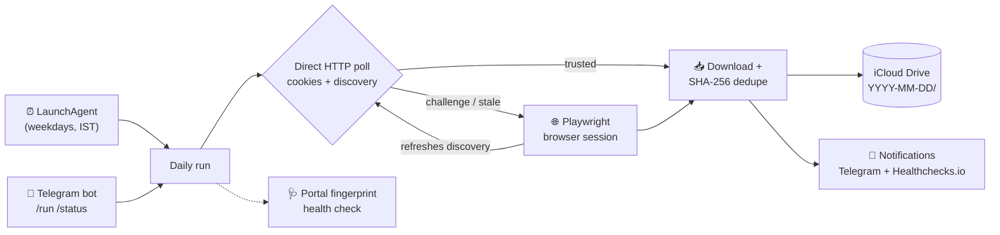

<div align="center">


# 📸 School Photo Downloader

**Every photo your school posts — auto-delivered to your iCloud, deduplicated, zero clicks.**

A local macOS automation that watches a MySchoolOne Pro portal and downloads
photo attachments the moment they appear. Deterministic first, AI-assisted only
when it has to be.

[](https://nodejs.org)
[](tsconfig.json)
[](https://playwright.dev)
[](#requirements)
[](#development)

</div>

---

## Why?

School portals are where photos go to be forgotten: buried behind logins,
OTP codes and Cloudflare, posted once, never exported. This project turns a
Raspberry-Pi-class Mac into a quiet pipeline:

> Portal posts photos → downloader notices → SHA-256 dedupe → files land in
> `iCloud Drive/School Updates/2026-08-20/` → they sync to your phone.
> A Telegram bot tells you what happened and takes commands from the couch.

## ✨ Highlights

- **⚡ Two-tier download engine** — a fast direct HTTP poll using saved cookies
  and captured AJAX endpoints, with an automatic Playwright browser fallback
  whenever the direct path can't be trusted (challenge pages, stale discovery,
  HTTP errors).
- **🧬 SHA-256 duplicate detection** — reopening the same update never creates
  a second copy of a photo.
- **🩺 Portal fingerprinting** — health checks hash the portal's DOM selectors,
  scripts and AJAX endpoints against a known-good baseline. Changes are only
  accepted after **two consecutive** sightings, so a transient Cloudflare
  interstitial never silently rewrites the baseline. You get notified *before*
  downloads break, not after.
- **🤖 Optional vision-agent rescue** — when the portal redesigns itself, a
  Holo3.1-powered browser agent can navigate by screenshot as a manual fallback.
  It is strictly **read-only**: no form submissions, messages or settings changes.
- **📅 Set-and-forget scheduling** — a macOS LaunchAgent runs weekday mornings
  and evenings (IST), reconciling the last 7 days each time, with an exclusive
  run lock so manual and scheduled runs never collide.
- **💬 Telegram remote control** — `/run`, `/status`, `/help` from your phone;
  failure alerts ("LOGIN REQUIRED", "ACTION NEEDED") come to you.
- **🔒 Privacy-first by default** — the daily path sends **no screenshots
  anywhere**. Credentials, cookies and school data stay on your Mac.

## 🏗️ Architecture



## 🚀 Quick start

### Requirements

- macOS with Node.js **20+** (`node --version`)
- An H Company Models API key *(only for the optional vision agent)*
- Your school's MySchoolOne Pro URL

### Install

```bash
git clone <this-repo> && cd myschoolone-holo-downloader
npm install
npm run install-browser
cp .env.example .env   # then fill in your values — never commit .env
```

Key `.env` settings:

| Variable | Purpose |
|---|---|
| `SCHOOL_URL` | Exact MySchoolOne Pro portal URL |
| `DOWNLOAD_DIR` | Where photos land (iCloud Drive path recommended) |
| `STATE_DIR` | Session cookies, discovery data, download index |
| `DIRECT_POLL` | `false` to skip the direct poll when Cloudflare blocks it |
| `TELEGRAM_BOT_TOKEN` / `TELEGRAM_CHAT_ID` | Enable the Telegram bot & alerts |
| `HEALTHCHECK_URL` | Healthchecks.io ping for dead-man alerts |

### One-time login

```bash
npm run login
```

A Chrome window opens; sign in once (including OTP/CAPTCHA). The session is
kept in a local browser profile plus a cookie snapshot for the direct HTTP
path — you won't need to do this again until the school expires it.

### First run

```bash
npm run daily
```

Photos arrive under `$DOWNLOAD_DIR/YYYY-MM-DD/`. That's the whole loop.

## 📅 Automation

Once manual runs work:

```bash
./scripts/install-launch-agent.sh            # downloader: weekdays 9 AM & 3 PM IST
./scripts/install-telegram-bot-launch-agent.sh  # Telegram bot, auto-restarts
```

Schedule times live in one place (`src/schedule-window.ts`); the installers
read them from there so the plists can't drift from the code.

> Scheduled GUI automation needs an unlocked macOS user session. For unattended
> recovery after power failure, enable automatic login and `pmset autorestart 1`.

## 🧰 Command reference

| Command | What it does |
|---|---|
| `npm run daily` | **Primary path.** Direct poll → browser fallback → download |
| `npm run status` | Totals, this week/month, last run, next scheduled run |
| `npm run summary` | Compact status summary |
| `npm run health` | Fingerprint the portal, compare against baseline |
| `npm run rescan` | Re-hash the download folder; repair a crashed run's index |
| `npm run agent` | Manual Holo vision-agent rescue run |
| `npm run capture` | Save screenshot + HTML of a troublesome page to `debug/` |
| `npm run telegram-bot` | Run the Telegram bot in the foreground |
| `npm run check` / `npm test` | Type-check / run the test suite |

## 🛟 Failure recovery

- **"LOGIN REQUIRED"** → session expired and auto-login failed. Run
  `npm run login`, complete OTP/CAPTCHA.
- **"ACTION NEEDED"** (3 consecutive failures) → `npm run login`, then
  `npm run health`, then `npm run status`.
- **"PORTAL CHANGED"** → the fingerprint changed. Usually cosmetic (a new tab
  appeared); re-running `npm run health` confirms and adopts the new baseline.
  Only worry if downloads actually fail.
- Cookie expiry warnings arrive 48 h before sessions die.

## 🔐 Privacy & safety

- The deterministic daily path sends **nothing** off your machine except the
  portal's own traffic.
- Vision-agent screenshots may contain names and photo thumbnails; they go to
  the model API for inference (zero data retention by default) — use only as a
  rescue tool, and never share `debug/` captures (they contain children's data).
- The agent prompt enforces read-only behavior: no messaging, form submission,
  acknowledgements, setting changes or deletions.
- Secrets (`.env`, cookies, tokens) are gitignored and never logged.

## 💻 Development

Strict TypeScript ES modules (NodeNext), tested with the built-in node test runner:

```bash
npm run check   # tsc --noEmit
npm test        # node --test
```

Keep changes minimal, add focused tests under `test/`, and see
[AGENTS.md](AGENTS.md) for contributor/agent conventions.

---

<div align="center">
<sub>Built for one parent's sanity. Yours too, if your school uses MySchoolOne Pro.</sub>
</div>
